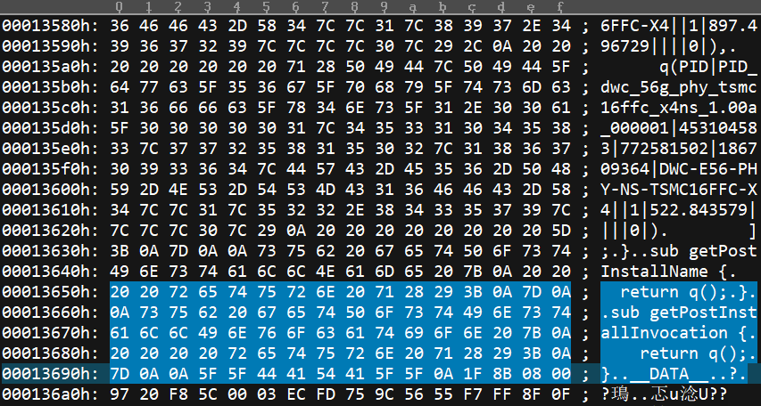

## 2.2 Designware 2019的破解

在2019年以后版本的designware ip，run文件中加入了ECC，因此不能直接使用license进行破解。本节讲解其原理以及破解步骤。

### 2.2.1 原理解释

### 2.2.2 步骤

Run文件是perl脚本加二进制组成的，其中包括dw_extract.tgz，这个是解包工具，2019版本以后，解包工具需要破解ECC，所以需要先抽出来，破解，然后再用他来解后面的解出数据。

#### 查看run的分割信息

```bash
grep -5nR "dw_extract" *run
```
返回如下信息：

```bash
2532-sub getLocalFileIndex {
2533-    return [
2534:        q(DWX|dw_extract.tgz|3036689|0|3927110528|||0|7.464476||||0|),
2535-        q(PID|PID_dwc_56g_phy_tsmc16ffc_x4ns_1.00a_000000|769544813|3036689|3956291005|DWC-E56-PHY-NS-TSMC16FFC-X4||1|897.496729||||0|),
2536-        q(PID|PID_dwc_56g_phy_tsmc16ffc_x4ns_1.00a_000001|453104583|772581502|186709364|DWC-E56-PHY-NS-TSMC16FFC-X4||1|522.843579||||0|)
2537-        ];
```
其中上述3个文件就是3个重要的分割，一般而言也是3个信息，第一个是dw_extract.tgz，第二个是告诉designware解出来的是完全解密版本的标识，第三个是数据，这部分内容最大。

#### 计算偏移
用UE在windows下打开run文件，找到二进制的起始处，查看文件偏移
```bash
sub getPostInstallName {
    return q();
}

sub getPostInstallInvocation {
    return q();
}

__DATA__
```
这个后面开始就是数据，查看16进制，看到0A（换行符）后面开始的就是数据，所以起始地址是0x1369C，如图所示。


<center>图1 UE十六进制视图查看数据起始点</center>

#### 手工分割
```
q(DWX|dw_extract.tgz|3036689|0|3927110528|||0|7.464476||||0|),
```
第一部分dw_extract.tgz就是从这个地方起始，大小为3036689的内容，上面的信息，第一个是文件名，第二个是大小，字节为单位，第三个是数据相对偏移，其他是校验和版本信息，没用。知道了起始地址和大小以后，在linux上用dd工具分割。
```bash
dd if=dwc_56g_phy_tsmc16ffc_x4ns_1.00a.run of=dw_extract.tgz skip=79516 bs=1 count=3036689
```
同样方法解出剩余两部分，skip改成最原始的79516加上相对偏移，bs=1是字节单位，不用改，count改成文件大小
检验方法就是，第一部分的dw_extract.tgz可以用tar xvfz解开。

#### 手工解压

1. 因为不能做到每个run文件都破解一次dw_extract，所以这里统一使用一个解密过的dw_extract来完成后面的工作，这里需要结合已启动的license。

2. 修改license的第一行hostname和mac地址为启动机器的hostname和mac地址，第二行为snpslmd的绝对路径，其他信息不能修改。建议license和snpslmd放在同一个目录。

3. 用提供的snpslmd和lmgrd启动license，并产生log：
```bash
lmgrd -c tempLic.txt -l license.log
```
观察log，license是否正常启动，如果不行debug排查一下原因

4. 将提供的dw_extract.linux64放到上面1中解开文件的文件夹中，运行
```bash
./dw_extract.linux64 -project Mamamiya01 PID_dwc_56g_phy_tsmc16ffc_x4ns_1.00a_000000
```
其中-project后面带的参数是projectID，和license的对应，不能修改；最后一个参数就是1中解出的文件。如果一切正常，则应顺利解开，如果失败了，从license log应该有看到checkout失败的记录。如果一开始不知道feature名字，可以启动一个其他的license看UPSUPPORTED feature再添加。注意这个feature需要带上PID=xxxxxxxx的信息。
5. 如法依次解出1中解密出来的其他文件，完成以后其生成目录即最终解出的信息。如果是iip，则需要进一步用coretools配置，如果是无需配置的，则解出目录即为最终版本。

至此完成RUN文件解出的叙述。

### 2.2.3 license修改


1. 首先按照旧的方法添加feature，并用scl_keygen产生出来一个以前可用的feature，注意这里需要用到的是SSS feature的信息。
2. 得到Synopsys.dat以后，大致内容如下，这里只列出SSS feature和一个实际feature。
```cpp
SERVER localhost 000c290b2c39 27000
DAEMON snpslmd 
INCREMENT SSS snpslmd 1.0 12-dec-2020 1 9EEFF5440C53E9F03CAD \
	VENDOR_STRING="1BB01 D774B 88C26 32D65 17DB0 58101 ED6A0 89395 \
	2D532 C63" ISSUER="Synopsys, Inc. [1/8/2014 0:43:49 26356 3.16.2]" \
	NOTICE="Licensed to student@eetop [DO NOT DELETE/MODIFY SSS OR ANY \
	OTHER KEYS IN THIS FILE]" SN=RK:0:0:1
INCREMENT DesignWare snpslmd 2019.2019 30-dec-2020 99 \
	VENDOR_STRING=^1+S&PID=9b530424& SUPERSEDE ISSUED=01-apr-2004 ck=40 \
	SN=RK:2671-0:167603:0 START=01-apr-2004 AUTH={ snpslmd=( \
	LK=3EAFD5F40C3E1527EA29) }
```
3. 删除SSS feature里面红字部分，在最后增加SIGN=0
4. 删除feature的红字部分，替换成SIGN=0
5. 将橙色MAC地址换成启动license机器的MAC地址，如果在scl_keygen已经完成这部操作也可以
6. 其他的内容基本不能改动，修改后如下，文件最终明明为new.src
```bash
SERVER localhost 000c290b2c39 27000
DAEMON snpslmd /home/gogo/synopsys/scl_11.7/linux/bin/snpslmd
INCREMENT SSS snpslmd 1.0 12-dec-2020 1 \
	VENDOR_STRING="1BB01 D774B 88C26 32D65 17DB0 58101 ED6A0 89395 \
	2D532 C63" ISSUER="Synopsys, Inc. [1/8/2014 0:43:49 26356 3.16.2]" \
	NOTICE="Licensed to student@eetop [DO NOT DELETE/MODIFY SSS OR ANY \
	OTHER KEYS IN THIS FILE]" SN=RK:0:0:1 SIGN=0
INCREMENT DesignWare snpslmd 2019.2019 30-dec-2020 99 \
	VENDOR_STRING=^1+S&PID=9b530424& SUPERSEDE ISSUED=01-apr-2004 ck=40 \
	SN=RK:2671-0:167603:0 START=01-apr-2004 AUTH={ snpslmd=( \
	SIGN=0) }
```
7. 用提供的linux下的Skeygen，执行如下命令：
```bash
Skeygen -i new.src -o new.dat
```
如果成功，将产生形如提供的license格式的输出。


